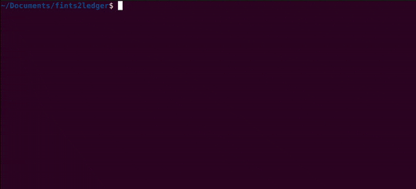

# fints2ledger
[](https://github.com/MoritzR/fints2ledger/actions) [](https://pypi.org/project/fints)

A tool for downloading transactions from FinTS banking APIs and sorting them into a [ledger journal](http://hledger.org/).

[pyfints](https://github.com/raphaelm/python-fints) is used to download the transactions. A list of compatible banks can be found there. This tool was tested with [ING][ing-link] and [GLS Bank][gls-link].



There is a pure python implementation available on the [python branch](https://github.com/MoritzR/fints2ledger/tree/python).

## Contents
- [Install](#install)
- [Usage](#usage)
- [Configuration](#configuration)
- [Changelog](#changelog)
- [Contributing](#contributing)

## Install
You can skip the next step if you are using [Nix](https://nixos.org/) to install fints2ledger.

Make sure you have Python installed at version 3.6 or higher. Install the Python dependencies using:
```
pip3 install "fints>=4,<5" "mt-940>=4.11,<5"
```

Next, you can install fints2ledger.

### using Nix
```
nix profile install github:MoritzR/fints2ledger
```


### from a pre-built binary
Grab the package for your system from the [releases page](https://github.com/MoritzR/fints2ledger/releases).
On Unix, don't forget to make the binary executable with `chmod +x fints2ledger`.

### from source
For this you need [cabal](https://www.haskell.org/cabal/#install-upgrade) installed. Then run
```
git clone git@github.com:MoritzR/fints2ledger.git
cd fints2ledger
cabal install
```
This might take a while.

## Usage
You can try out the program with the `demo` flag, which does not call any banking API.
```
fints2ledger --demo
```

To use a real connection run
```
fints2ledger
```
and enter your banking credentials in the following form. This only needs to be done once.
The full configuration is stored in `~/.config/fints2ledger/config.yml`.

For a list of available command line arguments, run
```
fints2ledger --help
```

### Automatically matching transactions
In the `ledger` section you can use a regex match on any field of the transaction data to automatically fill other fields.
The `amount` field uses comparison symbols instead of a regex. Valid values are for example "<=90.5", "120.13", "> 200"

Example: I do not want to enter a `credit_account` and `purpose` for my monthly recurring payments for the rent of my apartment. Same for my music streaming transactions. I can change the `config.yml` like this:
```yaml
ledger:
  ...
  fills:
    - match:
        payee: "The Landlord"
        purpose: "Rent for apartment B month.*"
      fill:
        credit_account: "expenses:monthly:rent"
        purpose: "monthly rent"
    - match:
        payee: "MUSIC COMPANY 123"
      fill:
        credit_account: "expenses:monthly:musiccompany"
        purpose: "Monthly fee for music streaming"
```
To only fill out parts of the transaction while still being prompted for others, leave the value empty for the fields that you like to be prompted for.
The following will fill out `credit_account` but still prompt for `purpose` (instead of taking the purpose from the original transaction).
```yaml
ledger:
  ...
  fills:
    - match:
        payee: "The Landlord"
      fill:
        credit_account: "expenses:monthly:rent"
        purpose:
```

## Configuration

The configuration file is located at `~/.config/fints2ledger/config.yml` (XDG config dir on Linux/macOS, `%APPDATA%\fints2ledger\config.yml` on Windows). Running `fints2ledger` for the first time will prompt you to create it, or use `fints2ledger --config` to open the editor UI.

### CLI flags

| Flag | Description | YAML equivalent |
|------|-------------|-----------------|
| `--files-path PATH` | Directory where fints2ledger stores its config files | — |
| `-f`, `--journal-file FILE` | Path to the ledger journal file | `ledger.journalFile` |
| `--date DATE` | Start date for fetching transactions (e.g. `25.01.2023`, `90 days ago`, `last monday`). Default: 90 days ago | — |
| `--python-command CMD` | Python executable to use. Default: `python3` | — |
| `--demo` | Run with sample transactions, without calling a FinTS endpoint | — |
| `--config` | Open the config editor UI | — |
| `--from-csv-file FILE` | Read transactions from a CSV file instead of a FinTS endpoint | — |
| `--to-csv-file FILE` | Write transactions to a CSV file instead of the ledger journal | — |

### Environment variables

| Variable | Description | YAML equivalent |
|----------|-------------|-----------------|
| `FINTS_PASSWORD` | Banking password. Takes precedence over the config file value. | `fints.password` |

### YAML config reference

```yaml
fints:
  blz: "<bank code (Bankleitzahl)>"
  account: "<account number>"       # This is what you use to login
  endpoint: "<FinTS endpoint URL>"
  selectedAccount: "<IBAN>"         # This should be the account number where the transactions are downloaded from. Required if this doesn't match your login.
  password: "<password>"            # optional: leave empty to be prompted for a password, or use the FINTS_PASSWORD environment variable

ledger:
  journalFile: "~/finances/journal.ledger"
  defaults:                         # pre-filled values for any transaction field
    debit_account: "assets:bank:checking"
  prompts:                          # fields to interactively prompt for
    - credit_account
  md5:                              # fields used for deduplication
    - date
    - payee
    - purpose
    - amount
  fills: []                         # auto-fill rules (see "Automatically matching transactions")
```

## Changelog
The changelog can be found in [CHANGELOG.md](CHANGELOG.md)

## Contributing
For additional information on how to work with the repository, see [CONTRIBUTING.md](CONTRIBUTING.md)

[ing-link]: https://www.ing.de
[gls-link]: https://www.gls.de
